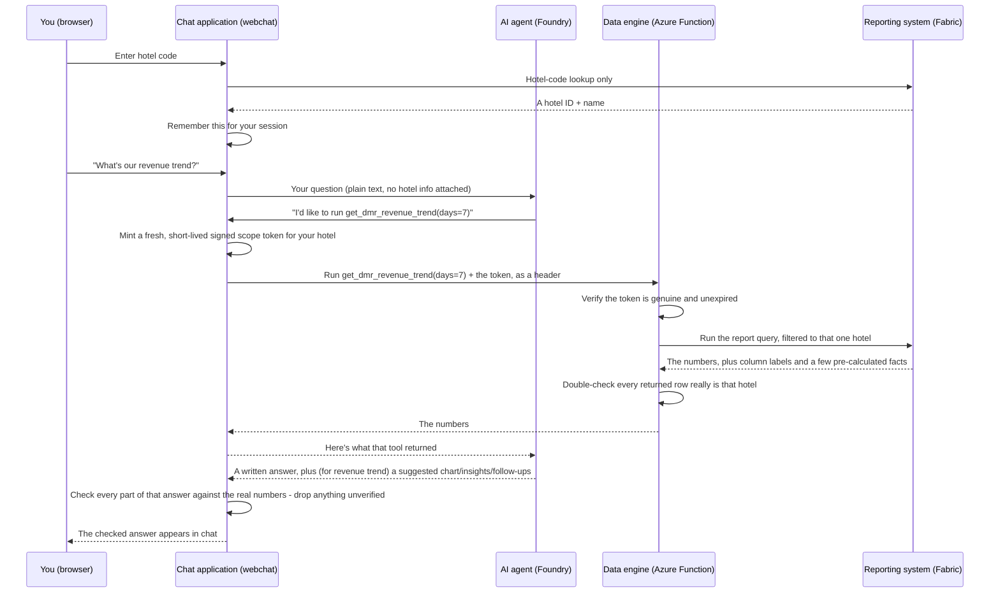

# How Ask ARIEL Works

A plain-language guide to the Ariel DMR (Daily Management Report) assistant — written so it makes sense whether you're reading the code or running a hotel.

## Ariel in 60 seconds

Ariel is a hotel-specific assistant for Daily Management Report data. A hotel user enters a property code and asks questions in plain English. Ariel selects one of four approved report tools, retrieves the relevant figures from Microsoft Fabric, and explains the result. For the revenue-trend report, Ariel can now also draw a chart and back up what it says with numbers it calculated itself — not arithmetic it made up on the spot.

Every request is restricted to the hotel resolved at login. The AI cannot select the hotel used for a report — even if another property is mentioned in the question, the data engine derives the report scope only from a verified, signed token it checks independently. And every chart, "insight," or follow-up suggestion the AI proposes is checked against the real data before it's shown — if it can't be checked, it's quietly left out, never shown unverified.

- **Current access control:** hotel isolation is enforced, but user identity is not yet verified. Knowing a hotel code proves you *know* the code, not that you're *authorized* to use it — there's no password behind it. These are two separate questions, and Ariel currently answers the first ("which hotel's data can this session see?") far more strongly than the second ("is this person allowed to use Ariel at all?").
- **Current status:** the data engine and the AI's behavior have both been substantially hardened since the first version — real retry/timeout handling, self-checks, and (for revenue trend) genuine charts and evidence-backed explanations. The chat application itself still runs locally on a laptop and still needs permanent hosting, real user authentication, persistent session storage, and production secret management.

## What Ariel can answer

Ariel is built to answer four things, and only four things — there's no way to ask for "all hotels" or "the other property," by design. Every one of these is always scoped to one hotel.

| Report | What it tells you | Comes with a chart & explained insights? |
|---|---|---|
| `get_dmr_revenue_trend` | Day-by-day revenue — actual, month-to-date, year-to-date, budget, forecast | **Yes** |
| `get_dmr_segment_mix` | Today's split of revenue by guest segment (Corporate, Leisure, Crew, ...) | Not yet — plain-language answer only |
| `get_dmr_fnb_performance` | Today's food & beverage performance by outlet | Not yet — plain-language answer only |
| `get_dmr_holdings_outlook` | Upcoming arrivals/departures/revenue for the days ahead | Not yet — plain-language answer only |

Revenue trend was the first (and so far only) report upgraded to the richer treatment, deliberately — see "How Ariel explains itself" below. The other three still work exactly as before; extending the richer treatment to them is a deliberate future step, not something that happens automatically.

## How a question becomes an answer

There are two separate pieces working together:

| Piece | What it is, in hotel terms | Folder |
|---|---|---|
| **The data engine** | The back office that retrieves reporting figures. It never talks to a person directly. | `mcp/` |
| **The chat application** | The front-desk kiosk where a hotel signs in and asks questions. | `webchat/` |

The chat application does not retrieve management-report figures itself — that's the data engine's only job. Its own one direct lookup is resolving a hotel code to an allowed hotel scope (a single, narrow Fabric query, separate from the four report tools above).

Step by step, when you ask a question:

1. You enter a hotel code at login.
2. The chat application looks that code up (a direct Fabric lookup) and remembers the resulting hotel scope server-side, tied to your session.
3. You ask a question in plain English.
4. The chat application hands your question to the AI agent — with no hotel information attached.
5. The AI agent picks one of the four approved report tools above and asks for it by name.
6. The chat application — not the AI — mints a fresh, short-lived signed scope token for your hotel and sends it to the data engine alongside the tool call. The AI never sees this token or any hotel field.
7. The data engine independently verifies the token (genuine signature, not expired, within its hard TTL ceiling) before running anything, then double-checks that every row Fabric returns actually belongs to that hotel.
8. Fabric runs the query, filtered to that one hotel, and returns the numbers — for revenue trend, along with plain labels for what each column means and a few facts the data engine already worked out itself (the best day, the worst day, the change over the period).
9. The AI writes an answer: a short explanation, and — only for revenue trend, and only when it can point to a real number backing each claim — a suggested chart and a few evidenced insights.
10. Before any of that reaches you, the chat application checks the AI's answer against the real data: is every chart field a real column, does the chosen chart type actually fit this data, is every insight backed by a real, matching number, is every suggested follow-up something Ariel can actually do. Anything that fails one of those checks is quietly dropped — never shown half-right.
11. The answer — text, and where earned, a chart, insights, and follow-up buttons — appears in your chat window.



## How Ariel explains itself

For revenue trend, Ariel does more than hand back a written sentence — and everything extra it hands back is checked, not taken on faith.

- **The data comes with labels, not just numbers.** The data engine tells the AI what each column actually *is* — this one's a date, this one's today's revenue and can be added up across days, this other one's a running month-to-date total that would badly overcount if you added it across days (an earlier version of this project actually hit that exact bug once — a hotel's total came out roughly 350× too high — so this label now exists specifically so it can't happen again).
- **Some facts are calculated once, by the data engine, not guessed by the AI.** The best day, the worst day, the percentage change over the period, and the latest budget variance are all worked out in plain code, not left to the AI's arithmetic. The AI's job is to explain those numbers, not recompute them.
- **The AI can suggest a chart — from a short, real list, not from imagination.** The data engine tells the AI which chart types would actually make sense for this data (for revenue trend today: a line, an area chart, or a plain table). The AI can only pick from that list; it can't invent a chart type that doesn't fit.
- **Every insight has to point at a real fact.** If the AI says "revenue peaked on the 15th," that claim has to reference the actual "highest day" fact the data engine calculated — an insight with nothing real behind it is dropped before you ever see it.
- **Follow-up buttons are real capabilities, not free-typed guesses.** "Change the period," "show segment mix," and so on are all backed by a fixed list of things Ariel can actually do — never a suggestion for an analysis (like "sales by region" or "top customers") Ariel has no way to actually run.
- **All of the above is checked again, independently, before you see it.** The chat application doesn't just trust that the AI followed these rules — it re-checks the chart's fields against the real column list, the chart type against the real compatible-chart list, every insight against the real facts, and every follow-up against the real fixed list. Anything that doesn't check out is quietly downgraded (usually to a plain table, or just the written words) rather than shown wrong.

The other three reports don't have the column labels or pre-calculated facts yet, so the AI is explicitly told to answer those in plain words only, with no chart and no "insights" — and even if it tried to invent one anyway, the check above has nothing real to verify it against, so it would be dropped regardless.

## How Ariel keeps hotels separate

Imagine a resort with several restaurants, and each guest gets a **wristband stamped with today's date and their room number**, printed by the front desk in a way no guest could fake at home.

- A staff member checks the wristband before serving anyone, every single time — not "does this look plausible," but "does the stamp actually match today, and is it a real stamp."
- The guest never touches their own wristband, let alone writes it — the front desk clips it on and shows it to each staff member directly.

That's what happens here:

1. You type a hotel **code** (like a room key), not a hotel name.
2. The chat application looks that code up itself and remembers a hotel ID server-side — you never see or hold it yourself.
3. When the AI asks for a report, the chat application — not the AI — mints a fresh scope token for your hotel and hands it straight to the data engine. The AI is never shown this step and never holds the token.
4. The data engine verifies that token itself, independently, before running any report, and then checks the numbers that came back really do belong to that hotel before handing them over. If anything's missing, altered, expired, or doesn't match, **it refuses** — it does not fall back to "just run it anyway."

The AI cannot select the hotel used for a report. Even if a user's question mentions another property by name, the data engine derives the report scope only from the verified token — never from anything in the conversation text.

The token itself is "sealed" with a two-part lock: the chat application holds the only key that can *mint* a new one, while the data engine only ever holds the matching key that can *verify* one — so even if someone broke into the data engine's side, they still couldn't forge a token for a hotel that isn't theirs.

## What's running today

| Question | Answer |
|---|---|
| Is the data engine deployed? | **Yes** — Azure Function App `ariel-mcp-server-v2`, resource group `Analytics` |
| Does the data engine check its own health? | **Yes** — a quick "is it running at all" check, a "can it really reach the reporting system" check, and a deeper "run one real test query" check, each a separate endpoint |
| Does the reporting connection retry and time out sensibly? | **Yes** — bounded retries with backoff, separate connect/read timeouts, and hard caps on response size, so one slow or misbehaving call can't hang the whole thing or return something oversized |
| Does the AI have real, written instructions? | **Yes** — as of this update. Before, the AI agent had *no* system instructions at all; it now has a written contract for how to answer, what it may and may not claim, and exactly which chart types and follow-up actions are allowed |
| Does revenue trend come with a chart and evidenced insights, live? | **Yes**, in production, today |
| Is the chat application deployed? | **No** — it's still run manually, on a laptop, with `python server.py` |
| Does it survive a restart? | Login sessions and chat history do **not** — they live only in memory/a local file, and reset if the chat application restarts |

## What still needs to be production-ready

- **User authentication.** The hotel-code check proves you *know* a code, not that you're *authorized* to use it — there's no password behind it. This isn't a substitute for a real login system with expiring sessions; it's a lighter-weight stand-in that closes the main gap (one hotel seeing another's numbers) without the full infrastructure that would eventually be worth building.
- **Persistent, multi-user session storage.** The chat application keeps its own conversation history in a plain file next to the code — fine for testing, not for a real multi-user deployment.
- **Permanent hosting.** The chat application still runs locally and needs a real deployment target.
- **Production secret management.** The data engine *can* now run on a Microsoft-managed identity instead of a stored password (built, tested, and ready to switch on) — but that switch itself, granting that identity access in the reporting system, hasn't been thrown yet, so it's still running on a stored client secret today.
- **Token replay tracking.** A scope token, once minted, isn't tracked as "already used" anywhere — a captured one still works until it naturally expires (a few minutes). "Fresh and short-lived" is the honest description; "one-time-use" would be overclaiming.
- **Measure-level verification (open item).** Nothing currently proves that a report's underlying *number* (not just the row it's attached to) was calculated using only the right hotel's data. Closing this would require reviewing the report definitions themselves for a specific class of authoring mistake — flagged as a known open item, not silently assumed fine. See `mcp/measure_guard.py` for the in-progress check and why an earlier verification attempt was a false negative.
- **Only one report has the richer treatment.** Segment mix, F&B performance, and holdings outlook still answer in plain words only — extending the column labels, pre-calculated facts, and chart support to them is real, but not yet done, work.

---

## Technical appendix

### Technology stack

| Layer | What's used | Why (in plain terms) |
|---|---|---|
| Language | Python | Both pieces are written in Python |
| Data engine hosting | **Azure Functions** (the "Flex Consumption" plan) | A Microsoft-managed compute that only runs — and only costs money — when someone actually asks it something |
| Where the numbers live | **Microsoft Fabric / Power BI**, queried with a language called **DAX** | The same reporting system your daily management reports already come from |
| The AI itself | **Azure AI Foundry**, running agent `ask-ariel` (version **11**) on GPT-5 | The "brain" that reads your question, decides which report tool to call, and now returns a written, schema-checked answer |
| Response shape enforced by | Foundry's structured-output (JSON-schema) support, generated from a shared **pydantic** model | So the AI's answer is checked at the source, not just hoped for |
| Chart rendering | **ECharts** (vendored locally in `webchat/static/vendor/`), plain JavaScript | The frontend, not the AI, decides colour/typography/formatting/tooltips — the AI only ever chooses a chart *type* and which columns go where |
| Chat application hosting | A small **Flask** web server, run manually today (not yet deployed anywhere permanent) | Serves the chat page in your browser |
| The "protocol" tools talk over | **MCP** (Model Context Protocol) | The standard the AI agent uses to ask the data engine for a report |

### Repository structure

```
mcp/                          <- THE DATA ENGINE (deployed to Azure, live)
├── function_app.py               entry point Azure runs - also exposes /health/live, /health/ready, /health/deep
├── server.py                     an alternate way to run it (local/dev only)
├── config.py                     settings from environment - auth mode, analytics flag, etc.
├── scope_token.py                mints/verifies the scope token
├── scope_context.py              the verified, trusted "this is who's asking" record
├── measure_guard.py              a check for a specific report-writing mistake (see limitations)
├── audit.py                      one internal telemetry event per tool call (never AI-visible)
├── health.py                     the liveness/readiness/deep-check logic behind the /health/* routes
├── fabric_client/
│   ├── service.py                 the hardened Fabric client - pooled connections, retries, timeouts, size caps
│   └── result.py                  a structured "here's the answer, or here's a safe error" box
├── dmr/
│   ├── reports.py                  the fixed list of reports/figures that are allowed to exist
│   ├── measures.py                 the exact report figures to pull (revenue, ADR, etc.)
│   ├── dax_query_builder.py        turns "give me 7 days of revenue" into the actual query
│   └── hotel_lookup.py             looks up a hotel's real display name + currency, for the analytics contract below
├── analytics/                     <- the semantic contract for revenue trend (see below)
│   ├── contract.py                 the versioned result shape (columns, facts, chart hints, actions)
│   ├── columns.py                  what each column actually means (a date? a currency? summable, or not?)
│   ├── facts.py                    the pre-calculated facts (best/worst day, % change, budget variance)
│   ├── actions.py                  the fixed list of real follow-ups this report can offer
│   └── revenue_trend.py            assembles all of the above into one result
└── tools/
    └── dmr_tools.py                the 4 real report tools the AI is allowed to call

webchat/                       <- THE CHAT APPLICATION (local only, not deployed yet)
├── server.py                     handles hotel-code login, runs the AI conversation, mints
│                                  scope tokens, calls the data engine, and checks the AI's answer
├── agent_contract.py              the shape the AI's answer must match (message/chart/insights/actions)
├── presentation_validator.py      re-checks that answer against the real data before it's shown
├── actions_registry.py            the fixed list of follow-ups webchat actually knows how to run
├── scripts/create_agent_version.py  creates a new ask-ariel agent version (never edits one in place)
├── templates/index.html          the actual page you see in the browser
├── static/                       styling, chart rendering (presentation.js), and browser-side behaviour
└── conversations.json             a saved history of past chats (a simple file, not a database)
```

### The analytics contract (revenue trend)

Behind an internal setting (`ARIEL_ANALYTICS_SCHEMA_VERSION`, currently **on** — `v1` — for revenue trend, on in production), the data engine's answer for that one report isn't just a bare list of numbers any more. It also includes:

- **Labelled columns** — for each figure, whether it's a date or a measure, what currency it's in, and critically, whether it's the kind of number you can safely add up across days (like "today's revenue") or a running total that you can't (like "month-to-date revenue" — adding that across several days would count the same money many times over).
- **A handful of pre-calculated facts** — the best day, the worst day, the change over the period, and the latest budget variance, each computed once in plain code from the real numbers.
- **A short list of chart types that would actually make sense** for this particular result (currently: line, area, or table).
- **A short list of real follow-up actions** available from here (change the period, or switch to one of the other three reports).

This is the information the AI's written answer (below) gets checked against. It intentionally never includes a hotel name, hotel id, or anything about who's asking — that's `scope_token.py`'s job, kept entirely separate.

### The AI's answer format

`ask-ariel` version 11 (the version this chat application now points at by default) is the first version of this agent with any written instructions at all — version 10 had none. It's told to answer in a fixed shape: a plain-English `message`, an optional chart suggestion, a list of insights (each required to point at one of the pre-calculated facts above), and a list of follow-up actions (each required to come from the fixed list above). Azure AI Foundry enforces that shape at the model level; `webchat/presentation_validator.py` independently re-checks every part of it against the real data before anything reaches the browser — a schema can confirm the AI said `"type": "line"`, but only this second check can confirm the fields it chose to plot are genuinely real, or that an "insight" isn't just something the model made up.

Version 10 is left exactly as it was, with no instructions and no chart support, for anyone still pointing at it explicitly. Switching back is a one-line configuration change (`ARIEL_AGENT_VERSION=10`), not a redeploy.

### Reporting tools

The four tools the AI agent is allowed to call, registered in `mcp/tools/dmr_tools.py`:

- `get_dmr_revenue_trend(days: int | None = None)`
- `get_dmr_segment_mix()`
- `get_dmr_fnb_performance()`
- `get_dmr_holdings_outlook(days: int | None = None)`

None of them accept a hotel field as an argument — the hotel scope arrives only via the verified `X-Ariel-Scope` token header, resolved server-side from the caller's session. An out-of-range `days` is rejected outright (never silently shortened) so a partial answer can never look like a complete one.

### Required configuration

| Setting | Lives on | What it's for |
|---|---|---|
| `AR_FABRIC_AUTH_MODE` | Data engine | `client_secret` (today, in production) or `managed_identity` (built and ready — see "still needs to be production-ready" above) |
| `AR_FABRIC_TENANT_ID` / `AR_FABRIC_CLIENT_ID` / `AR_FABRIC_CLIENT_SECRET` | Both | Identifies the service account that's allowed to log into the reporting system — the actual secret is never shared or displayed. Required only in `client_secret` mode |
| `ARIEL_SCOPE_PRIVATE_KEY` + `ARIEL_SCOPE_SIGNING_KID` | Chat application only | The signing key. Never goes anywhere near the data engine |
| `ARIEL_SCOPE_PUBLIC_KEYS` | Data engine only | The matching verification key(s) — safe to hold even if this side were compromised, since it can't be used to mint a token |
| `ARIEL_ANALYTICS_SCHEMA_VERSION` | Data engine | `legacy` (plain answers, every report) or `v1` (the richer revenue-trend answer described above) — currently `v1` in production |
| `ARIEL_AGENT_VERSION` | Chat application | Which `ask-ariel` version to use — currently `11` by default; set to `10` to roll back to the plain, uninstructed agent |

Right now the chat application's settings have to be typed into the terminal window every time before starting it (they don't persist automatically).
