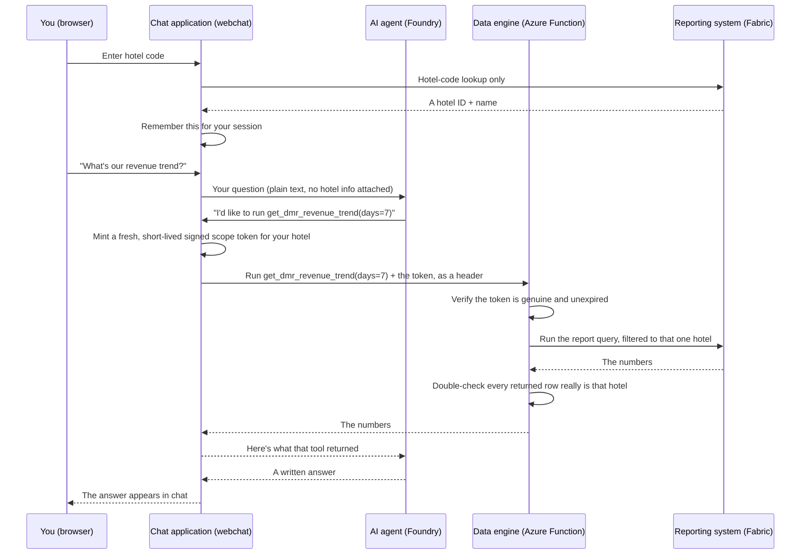

# How Ariel Works

A plain-language guide to the Ariel DMR (Daily Management Report) assistant — written so it makes sense whether you're reading code or running a hotel.

## Ariel in 60 seconds

Ariel is a hotel-specific assistant for Daily Management Report data. A hotel user enters a property code and asks questions in plain English. Ariel selects one of four approved report tools, retrieves the relevant figures from Microsoft Fabric, and explains the result.

Every request is restricted to the hotel resolved at login. The AI cannot select the hotel used for a report — even if another property is mentioned in the question, the data engine derives the report scope only from a verified, signed token it checks independently.

- **Current access control:** hotel isolation is enforced, but user identity is not yet verified. Knowing a hotel code proves you *know* the code, not that you're *authorized* to use it — there's no password behind it. These are two separate questions, and Ariel currently answers the first ("which hotel's data can this session see?") far more strongly than the second ("is this person allowed to use Ariel at all?").
- **Current status:** the data engine (the reporting logic) is deployed and live in Azure. The chat application currently runs locally on a laptop and still needs permanent hosting, real user authentication, persistent session storage, and production secret management.

## What Ariel can answer

Ariel is built to answer four things, and only four things — there's no way to ask for "all hotels" or "the other property," by design. Every one of these is always scoped to one hotel.

| Report | What it tells you |
|---|---|
| `get_dmr_revenue_trend` | Day-by-day revenue — actual, month-to-date, year-to-date, budget, forecast |
| `get_dmr_segment_mix` | Today's split of revenue by guest segment (Corporate, Leisure, Crew, ...) |
| `get_dmr_fnb_performance` | Today's food & beverage performance by outlet |
| `get_dmr_holdings_outlook` | Upcoming arrivals/departures/revenue for the days ahead |

## How a question becomes an answer

There are two separate pieces working together:

| Piece | What it is, in hotel terms | Folder |
|---|---|---|
| **The data engine** | The back office that retrieves reporting figures. It never talks to a person directly. | `mcp/` |
| **The chat application** | The front-desk kiosk where a hotel signs in and asks questions. | `webchat/` |

The chat application does not retrieve management-report figures itself — that's the data engine's only job. Its own one direct lookup is resolving a hotel code to an allowed hotel scope (a single, narrow Fabric query, separate from the four report tools above).

Step by step, when you ask a question:

1. You enter a hotel code at login.
2. The chat application looks that code up (a direct Fabric lookup) and remembers the resulting hotel scope server-side, tied to your session.
3. You ask a question in plain English.
4. The chat application hands your question to the AI agent — with no hotel information attached.
5. The AI agent picks one of the four approved report tools above and asks for it by name.
6. The chat application — not the AI — mints a fresh, short-lived signed scope token for your hotel and sends it to the data engine alongside the tool call. The AI never sees this token or any hotel field.
7. The data engine independently verifies the token (genuine signature, not expired, within its hard TTL ceiling) before running anything, then double-checks that every row Fabric returns actually belongs to that hotel.
8. Fabric runs the query, filtered to that one hotel, and returns the numbers.
9. The AI turns the numbers into a written answer, which appears in your chat window.



## How Ariel keeps hotels separate

Imagine a resort with several restaurants, and each guest gets a **wristband stamped with today's date and their room number**, printed by the front desk in a way no guest could fake at home.

- A staff member checks the wristband before serving anyone, every single time — not "does this look plausible," but "does the stamp actually match today, and is it a real stamp."
- The guest never touches their own wristband, let alone writes it — the front desk clips it on and shows it to each staff member directly.

That's what happens here:

1. You type a hotel **code** (like a room key), not a hotel name.
2. The chat application looks that code up itself and remembers a hotel ID server-side — you never see or hold it yourself.
3. When the AI asks for a report, the chat application — not the AI — mints a fresh scope token for your hotel and hands it straight to the data engine. The AI is never shown this step and never holds the token.
4. The data engine verifies that token itself, independently, before running any report, and then checks the numbers that came back really do belong to that hotel before handing them over. If anything's missing, altered, expired, or doesn't match, **it refuses** — it does not fall back to "just run it anyway."

The AI cannot select the hotel used for a report. Even if a user's question mentions another property by name, the data engine derives the report scope only from the verified token — never from anything in the conversation text.

The token itself is "sealed" with a two-part lock: the chat application holds the only key that can *mint* a new one, while the data engine only ever holds the matching key that can *verify* one — so even if someone broke into the data engine's side, they still couldn't forge a token for a hotel that isn't theirs.

## What's running today

| Question | Answer |
|---|---|
| Is the data engine deployed? | **Yes** — Azure Function App `ariel-mcp-server-v2`, resource group `Analytics` |
| Is the chat application deployed? | **No** — it's run manually, on a laptop, with `python server.py` |
| Does it survive a restart? | Login sessions and chat history do **not** — they live only in memory/a local file, and reset if the chat application restarts |

## What still needs to be production-ready

- **User authentication.** The hotel-code check proves you *know* a code, not that you're *authorized* to use it — there's no password behind it. This isn't a substitute for a real login system with expiring sessions; it's a lighter-weight stand-in that closes the main gap (one hotel seeing another's numbers) without the full infrastructure that would eventually be worth building.
- **Persistent, multi-user session storage.** The chat application keeps its own conversation history in a plain file next to the code — fine for testing, not for a real multi-user deployment.
- **Permanent hosting.** The chat application still runs locally and needs a real deployment target.
- **Production secret management.** Credentials currently have to be typed into the terminal every time before starting the chat application (see [Required configuration](#required-configuration)) — a known rough edge, not a permanent design choice.
- **Token replay tracking.** A scope token, once minted, isn't tracked as "already used" anywhere — a captured one still works until it naturally expires (a few minutes). "Fresh and short-lived" is the honest description; "one-time-use" would be overclaiming.
- **Measure-level verification (open item).** Nothing currently proves that a report's underlying *number* (not just the row it's attached to) was calculated using only the right hotel's data. Closing this would require reviewing the report definitions themselves for a specific class of authoring mistake — flagged as a known open item, not silently assumed fine. See `mcp/measure_guard.py` for the in-progress check and why an earlier verification attempt was a false negative.

---

## Technical appendix

### Technology stack

| Layer | What's used | Why (in plain terms) |
|---|---|---|
| Language | Python | Both pieces are written in Python |
| Data engine hosting | **Azure Functions** (the "Flex Consumption" plan) | A Microsoft-managed compute that only runs — and only costs money — when someone actually asks it something |
| Where the numbers live | **Microsoft Fabric / Power BI**, queried with a language called **DAX** | The same reporting system your daily management reports already come from |
| The AI itself | **Azure AI Foundry**, running an agent named `ask-ariel` on GPT-5 | The "brain" that reads your question and decides which report tool to call |
| Chat application hosting | A small **Flask** web server, run manually today (not yet deployed anywhere permanent) | Serves the chat page in your browser |
| The "protocol" tools talk over | **MCP** (Model Context Protocol) | The standard the AI agent uses to ask the data engine for a report |

### Repository structure

```
mcp/                          <- THE DATA ENGINE (deployed to Azure, live)
├── function_app.py               the actual entry point Azure runs
├── server.py                     an alternate way to run it (not used today)
├── config.py                     reads the passwords/IDs from settings, once
├── scope_token.py                mints/verifies the scope token — see security section above
├── scope_context.py              the verified, trusted "this is who's asking" record
├── measure_guard.py              a check for a specific report-writing mistake (see limitations)
├── fabric_client/
│   ├── service.py                 knows HOW to ask Power BI a question
│   └── result.py                  a simple "here's the answer, or here's the error" box
├── dmr/
│   ├── reports.py                  the fixed list of reports/figures that are allowed to exist
│   ├── measures.py                 the exact report figures to pull (revenue, ADR, etc.)
│   └── dax_query_builder.py        turns "give me 7 days of revenue" into the actual query
└── tools/
    ├── diagnostics.py              a "ping" tool, just to check the engine is alive
    └── dmr_tools.py                 the 4 real report tools the AI is allowed to call

webchat/                       <- THE CHAT APPLICATION (local only, not deployed yet)
├── server.py                     handles hotel-code login, runs the AI conversation, mints
│                                  scope tokens, and calls the data engine for every report
├── templates/index.html          the actual page you see in the browser
├── static/                       styling and browser-side behaviour
└── conversations.json             a saved history of past chats (a simple file, not a database)
```

### Reporting tools

The four tools the AI agent is allowed to call, registered in `mcp/tools/dmr_tools.py`:

- `get_dmr_revenue_trend(days: int | None = None)`
- `get_dmr_segment_mix()`
- `get_dmr_fnb_performance()`
- `get_dmr_holdings_outlook(days: int | None = None)`

None of them accept a hotel field as an argument — the hotel scope arrives only via the verified `X-Ariel-Scope` token header, resolved server-side from the caller's session.

### Required configuration

| Setting | Lives on | What it's for |
|---|---|---|
| `AR_FABRIC_TENANT_ID` / `AR_FABRIC_CLIENT_ID` / `AR_FABRIC_CLIENT_SECRET` | Both | Identifies the service account that's allowed to log into the reporting system — the actual secret is never shared or displayed |
| `ARIEL_SCOPE_PRIVATE_KEY` + `ARIEL_SCOPE_SIGNING_KID` | Chat application only | The signing key. Never goes anywhere near the data engine |
| `ARIEL_SCOPE_PUBLIC_KEYS` | Data engine only | The matching verification key(s) — safe to hold even if this side were compromised, since it can't be used to mint a token |

Right now these have to be typed into the terminal window every time before starting the chat application (they don't persist automatically).
